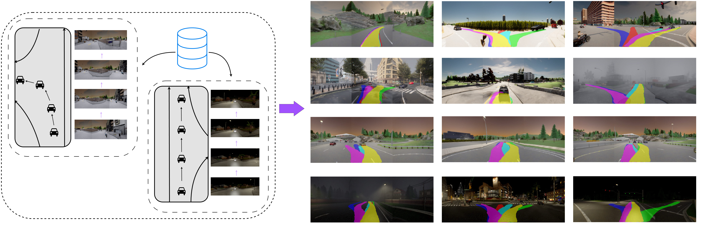

# 🚗 Diffusion-FS: Multimodal Free-Space Prediction via Diffusion for Autonomous Driving

**Authors:** Keshav Gupta, Tejas S. Stanley, Pranjal Paul, Arun K. Singh, K. Madava Krishna

[](https://diffusion-freespace.github.io/)

## 📋 Table of Contents

- [🚀 Quick Start](#-quick-start)
- [🐍 Environment Setup](#-environment-setup)
- [📊 Dataset Preparation](#-dataset-preparation)
- [🔮 Inference](#-inference)
- [📈 Evaluation](#-evaluation)
- [🏋️ Training](#-training)
- [🤝 Contributing](#-contributing)
<!-- - [📄 Citation](#-citation) -->

## 🚀 Quick Start

This repository implements Diffusion-FS, a novel approach for multimodal free-space prediction in autonomous driving using diffusion models. From a dataset of raw driving logs containing image and ego trajectory pairs, our self supervised method processes such an
unannotated dataset to generate freespace segments essential for autonomous driving. At inference, our model denoises a fixed number of noise samples into freespace segments.
We showcase predictions across various weather conditions, times of day, road topologies, and obstacle layouts. We show the results of our method on both simulated (CARLA) and real-world (NuScenes) datasets.



## 🐍 Environment Setup

### Prerequisites
- Python 3.10.16
- CUDA-compatible GPU (recommended)
- Conda package manager

### Installation Steps

1. **Create and activate conda environment:**
```bash
conda create -n diff_fs_env python=3.10.16 -y
conda activate diff_fs_env
```

2. **Install PyTorch with CUDA support:**
```bash
pip install torch==2.3.1+cu118 torchvision torchaudio --index-url https://download.pytorch.org/whl/cu118
```
> **Note:** Replace `cu118` with your CUDA version (e.g., `cu121` for CUDA 12.1)

3. **Install additional dependencies:**
```bash
pip install -r requirements.txt
```

## 📊 Dataset Preparation

We perform experiments on both **CARLA** (simulated) and **NuScenes** (real-world) datasets.

### 🏎️ CARLA Dataset

#### Option 1: Download Pre-cached Dataset (Recommended)
1. Download from [HuggingFace Dataset Repository](https://huggingface.co/datasets/keshav0306/diff_fs)
2. Contains cached training/evaluation data and scenario-wise situation classes (no lane, single lane, multilane, intersection)
3. Merge the splits:
```bash
mv carla/carla_train/split_*/*.npz carla/carla_train/
rm -r carla/carla_train/split_*
```

#### Option 2: Generate from LAV Dataset
1. Download data from [LAV repository](https://github.com/dotchen/LAV)
2. Cache manually using `datasets_all/fs_dataset.py`
3. Update `data_dir_train` and `data_dir_test` in `datasets_all/fs_cached.yaml`

### 🌍 NuScenes Dataset

#### Option 1: Download Pre-cached Dataset (Recommended)
1. Download from [HuggingFace Dataset Repository](https://huggingface.co/datasets/keshav0306/diff_fs)
2. Merge the splits:
```bash
mv nuscenes/FS/split_*/*.npz nuscenes/FS/
mv nuscenes/fs_meta/split_*/*.npz nuscenes/fs_meta/
rm -r nuscenes/FS/split_*
rm -r nuscenes/fs_meta/split_*
```

#### Option 2: Generate Yourself
Use the script: `dataset_all/nusc_save.py`

## 🔮 Inference

### 📥 Download Pretrained Models

Download checkpoints from [Google Drive](https://drive.google.com/drive/folders/1MEtb71k83aSxhz_TvZ3OHtYJtLJhbl_9?usp=sharing):

- **CARLA Base:** `pretrained_ckpts/carla_base.ckpt`
- **CARLA Command Conditioning:** `pretrained_ckpts/carla_cls.ckpt`
- **NuScenes Base:** `pretrained_ckpts/nuscenes_base.ckpt`

### 🎯 Run Inference

```bash
python3 infer.py
```

**Configuration Options** (modify at the beginning of `infer.py`):
- Config file path
- Checkpoint path
- Output visualization path
- Noise template usage (optional)
- Obstacle guidance during inference (optional)

**Output:** 6 inferred freespace segments overlayed on each input image.

## 📈 Evaluation

### 🏎️ CARLA Evaluation

#### Basic Evaluation
```bash
python3 evaluate.py
```

#### Directional Deviation Metrics
```bash
python3 dd_calc.py
```

#### Comprehensive Evaluation (All 5 Experiments)
Run all experiments (base, obs, cls, noise, obs+cls) sequentially:
```bash
python3 eval_all_dd.py
```

Parse and display results:
```bash
python3 calc.py
```

**Configuration Options** (modify at the beginning of each script):
- Checkpoint path
- Config file path
- Noise template usage (optional)
- Obstacle guidance during inference (optional)
- Situation classes folder path (for `eval_all_dd.py`)

**Precomputed Results:** Available in `results/` folder

### 🌍 NuScenes Evaluation

```bash
python3 evaluate.py
```
Use the same optional arguments as CARLA evaluation.

## 🏋️ Training

### Configuration
Modify hyperparameters in:
- `configs/carla.yaml` (for CARLA dataset)
- `configs/nuscenes.yaml` (for NuScenes dataset)

**Available Parameters:**
- Model hyperparameters
- Optimizer settings
- Checkpointing paths
- Diffusion denoising parameters

### Start Training
```bash
python3 train.py
```

## 🤝 Contributing

We welcome contributions! Please feel free to submit issues and pull requests.

<!-- ## 📄 Citation

If you find this work useful, please cite our paper:

```bibtex
@article{gupta2024diffusion,
  title={Diffusion-FS: Multimodal Free-Space Prediction via Diffusion for Autonomous Driving},
  author={Gupta, Keshav and Stanley, Tejas S. and Paul, Pranjal and Singh, Arun K. and Krishna, K. Madava},
  year={2024}
}
``` -->

---

📧 **Contact:** For questions or issues, please open an issue on GitHub or contact the authors.

🌟 **Star this repo** if you find it helpful!